# VSCode Themes

> Una colección de temas para VSCode.

Normalmente comparto estos temas a través de mis redes sociales:

Instagram: [@fili.santillan](https://www.instagram.com/fili.santillan/)  
Twitter: [@FiliSantillan](https://twitter.com/FiliSantillan)  
Facebook: [Fili Santillán](https://www.facebook.com/FiliSantillan96/)  
Sitio web: http://filisantillan.com

## 🎨 Temas

### [An Old Hope Theme](https://vscodethemes.com/e/dustinsanders.an-old-hope-theme-vscode)

<a href="https://vscodethemes.com/e/dustinsanders.an-old-hope-theme-vscode" target="_blank">
  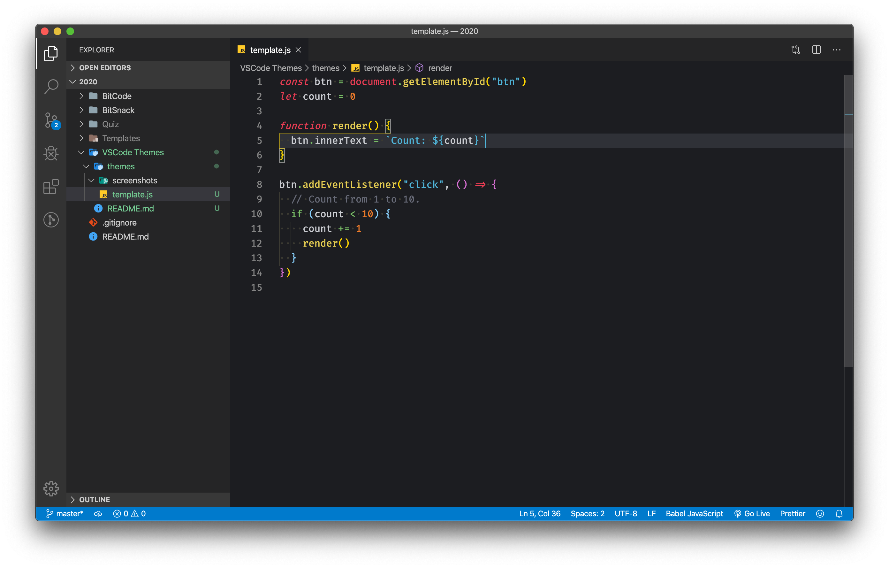
</a>

### [One Dark Pro](https://vscodethemes.com/e/zhuangtongfa.Material-theme)

<a href="https://vscodethemes.com/e/zhuangtongfa.Material-theme" target="_blank">
  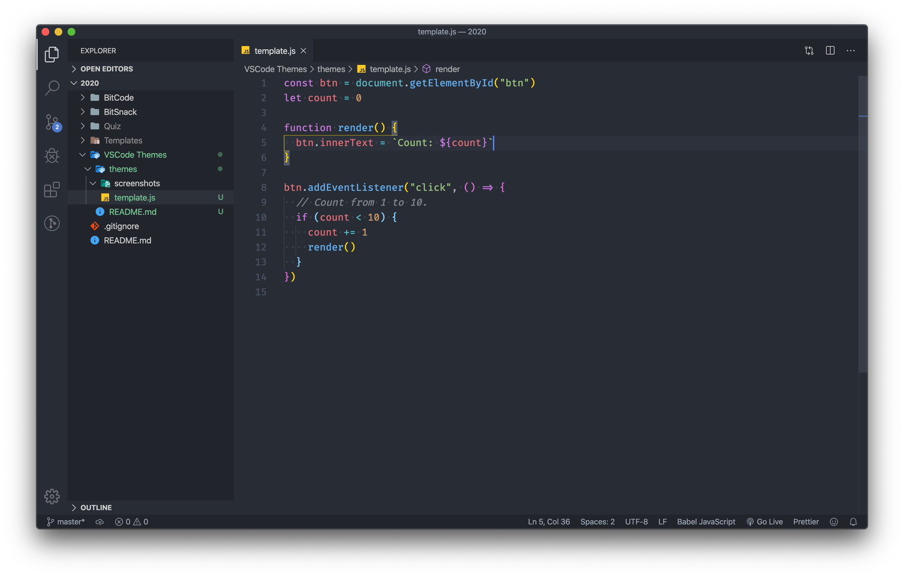
</a>

### [Last Room Light](https://marketplace.visualstudio.com/items?itemName=gerane.Theme-LastRoomLight)

<a href="https://marketplace.visualstudio.com/items?itemName=gerane.Theme-LastRoomLight" target="_blank">
  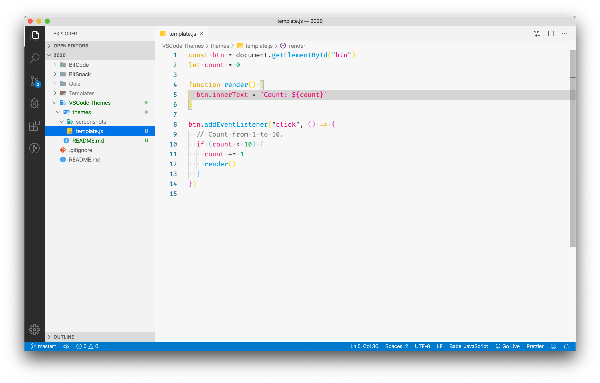
</a>

### [Monokai Pro](https://vscodethemes.com/e/monokai.theme-monokai-pro-vscode)

<a href="https://vscodethemes.com/e/monokai.theme-monokai-pro-vscode" target="_blank">
  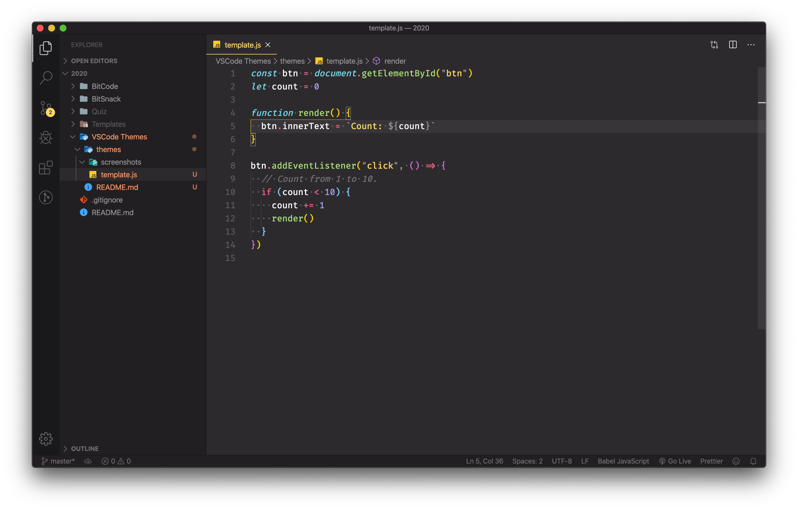
</a>

### [Code Blue](https://vscodethemes.com/e/Sujan.code-blue)

<a href="https://vscodethemes.com/e/Sujan.code-blue" target="_blank">
  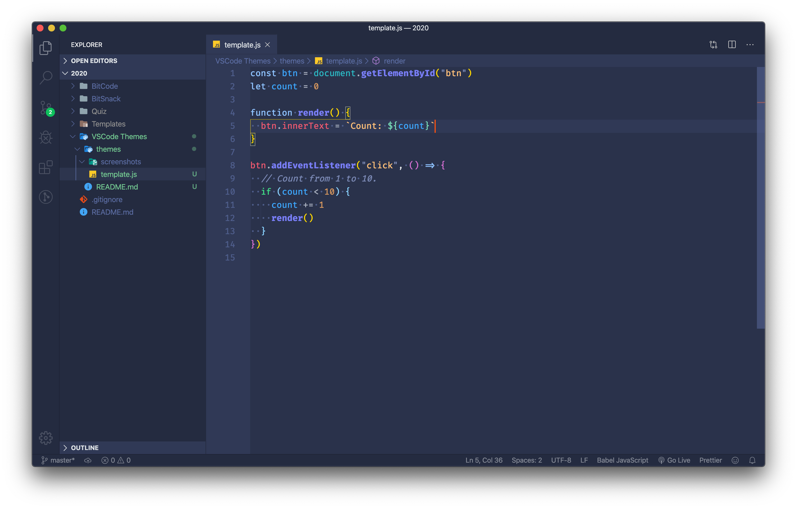
</a>

### [Paraiso Dark](https://marketplace.visualstudio.com/items?itemName=gerane.Theme-Paraisodark)

<a href="https://marketplace.visualstudio.com/items?itemName=gerane.Theme-Paraisodark" target="_blank">
  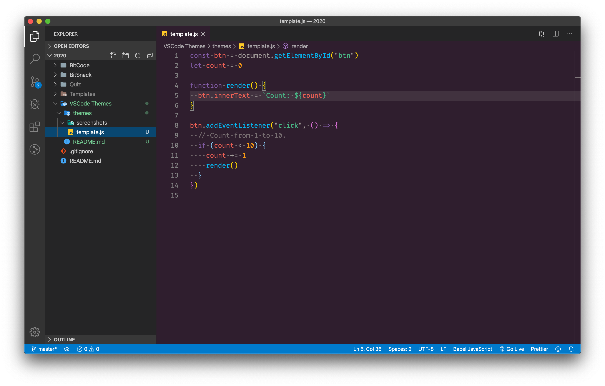
</a>

### [Slack Theme Hoth](https://vscodethemes.com/e/felipe-mendes.slack-theme)

<a href="https://vscodethemes.com/e/felipe-mendes.slack-theme" target="_blank">
  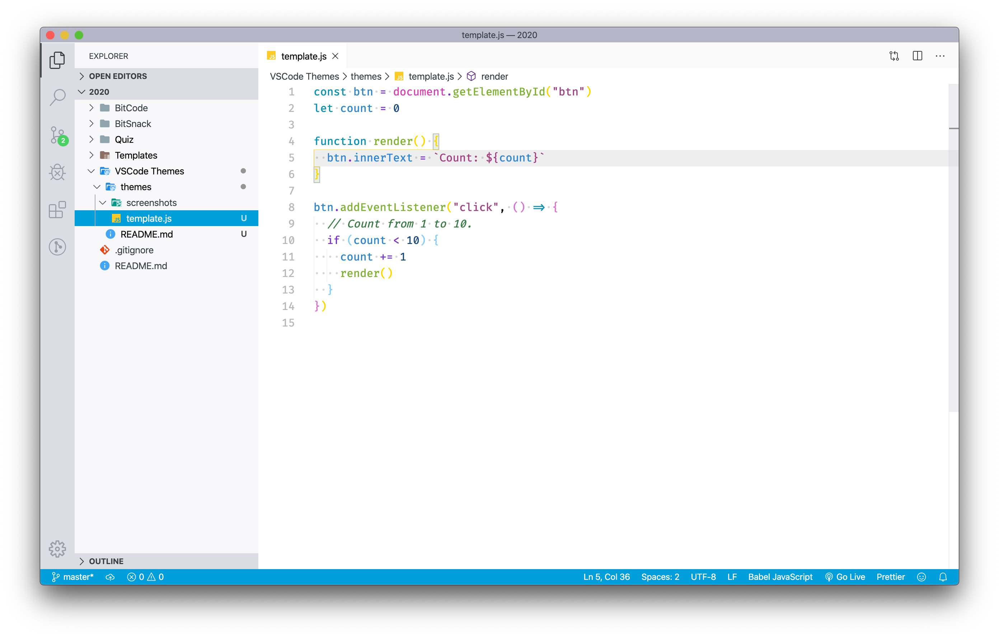
</a>

### [Dobri Next](https://vscodethemes.com/e/sldobri.bunker)

<a href="https://vscodethemes.com/e/sldobri.bunker" target="_blank">
  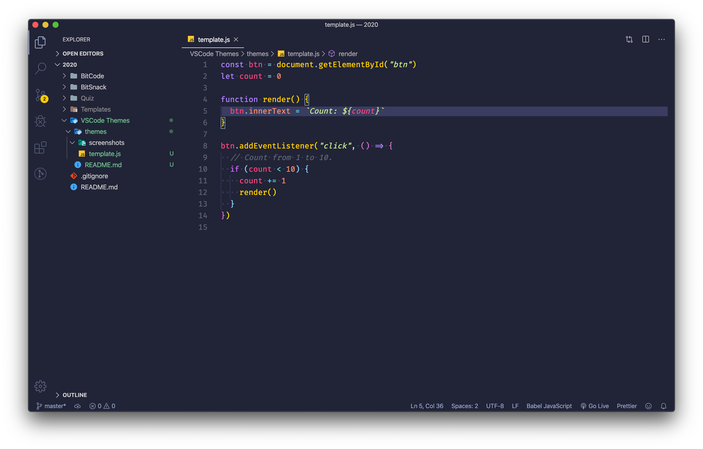
</a>

### [Andromeda](https://vscodethemes.com/e/EliverLara.andromeda)

### [Mirage](https://vscodethemes.com/e/tristanremy.mirage)

<a href="https://vscodethemes.com/e/tristanremy.mirage" target="_blank">
  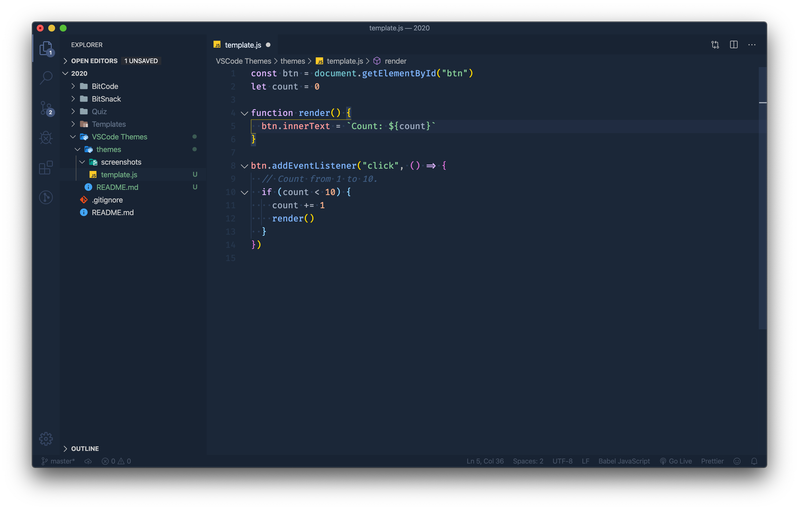
</a>

### [Pop N' Lock Theme by Luxcium ✨](https://vscodethemes.com/e/Luxcium.pop-n-lock-theme-vscode)

<a href="https://vscodethemes.com/e/Luxcium.pop-n-lock-theme-vscode" target="_blank">
  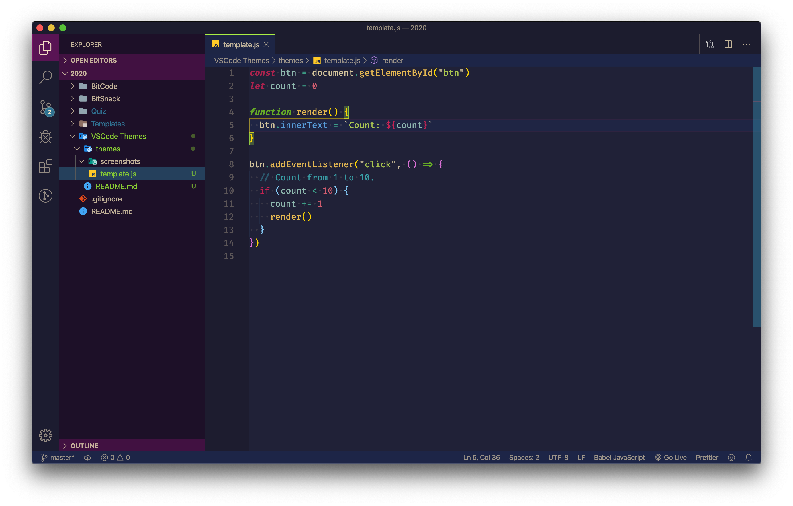
</a>

### [Shades of Purple](https://vscodethemes.com/e/ahmadawais.shades-of-purple)

### [Lucy](https://vscodethemes.com/e/juliettepretot.lucy-vscode)

<a href="https://vscodethemes.com/e/juliettepretot.lucy-vscode" target="_blank">
  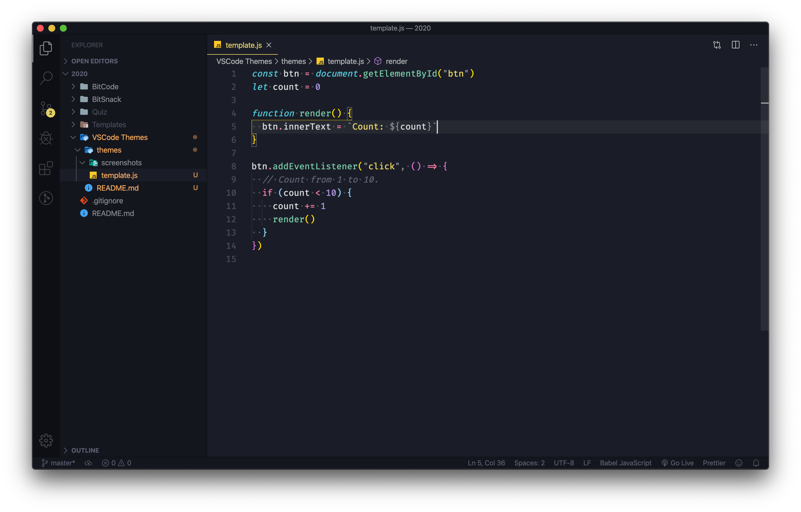
</a>

### [Horizon](https://marketplace.visualstudio.com/items?itemName=jolaleye.horizon-theme-vscode)

<a href="https://marketplace.visualstudio.com/items?itemName=jolaleye.horizon-theme-vscode" target="_blank">
  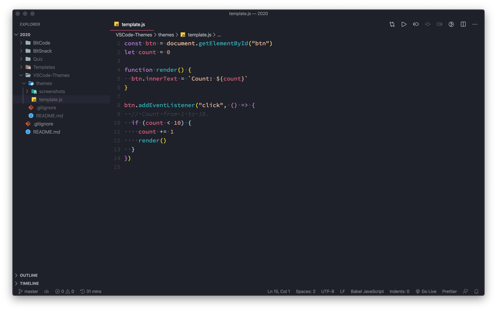
</a>

### [XD Theme](https://marketplace.visualstudio.com/items?itemName=jeff-hykin.xd-theme)

<a href="https://marketplace.visualstudio.com/items?itemName=jeff-hykin.xd-theme" target="_blank">
  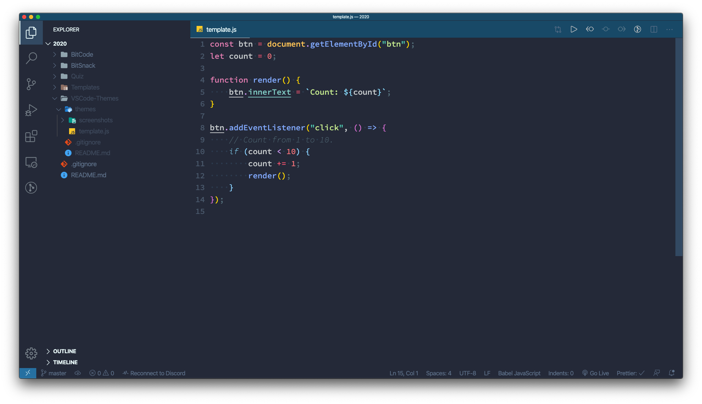
</a>

El template del código original lo he sacado de: https://github.com/viatsko/awesome-vscode/blob/master/themes/theme-template.js

## 📜 Licencia

Este trabajo esta bajo una licencia [CC BY 4.0](https://creativecommons.org/licenses/by/4.0/deed.es).

Debido a que este es mi repositorio personal, la licencia solo aplica para el contenido que yo he creado y no los para los recursos de los autores de cada tema ni para Visual Studio Code.

